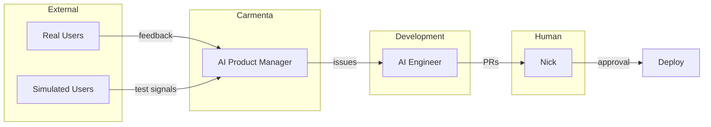
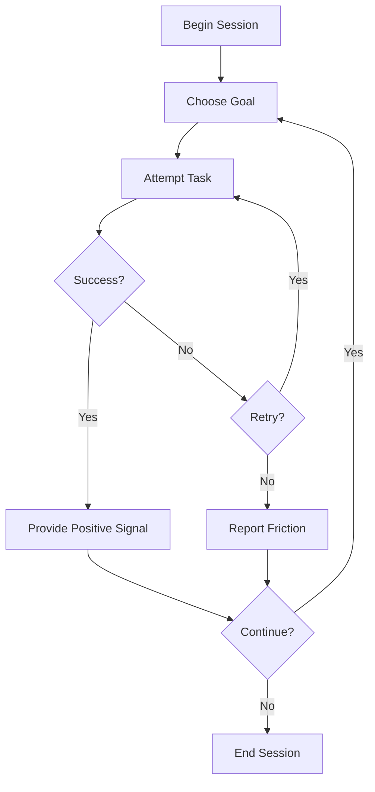
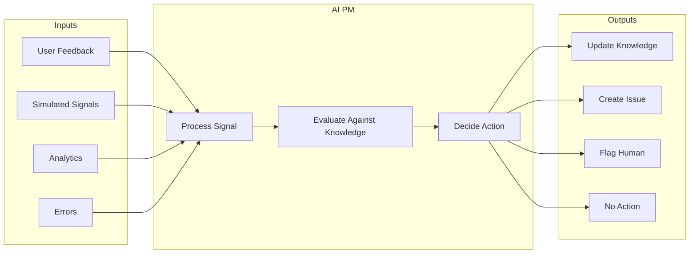
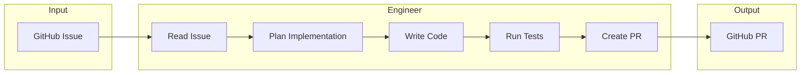
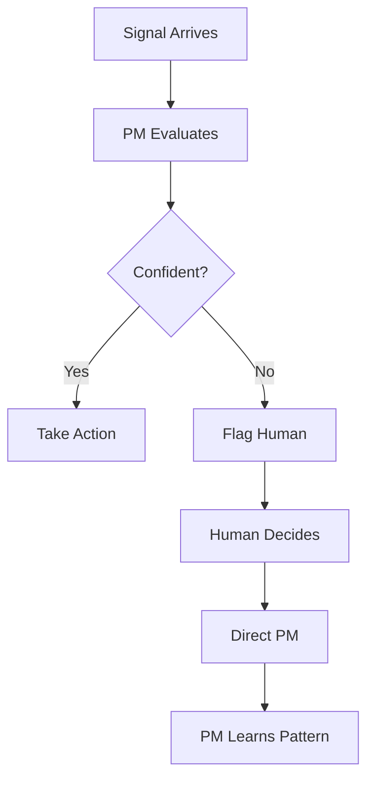

# System Actors

Five actors coordinate to create the autonomous feedback loop. Each has a distinct role,
defined boundaries, and specific tools.

## Actor Overview



## Real Users

### Role

Humans who use Carmenta for their actual work. They provide genuine feedback based on
real needs and real friction.

### Value

Real user feedback is precious because it reflects actual use cases, genuine confusion,
and real-world context that cannot be simulated. A single piece of real user feedback
often reveals more than hundreds of simulated interactions.

### Interaction Pattern

Real users interact with Carmenta normally. When they encounter friction or have
suggestions, they can:

1. Mention it naturally in conversation
2. @mention Carmenta explicitly for feedback mode
3. Report bugs through standard channels

The AI PM monitors for feedback signals and routes them appropriately.

### What We Learn From Real Users

- Use cases we didn't anticipate
- Confusion that simulated users don't experience
- Feature requests grounded in real workflows
- Edge cases from real-world data
- Emotional responses and trust signals

### Limitations

- Sparse feedback (most users don't report friction)
- Selection bias (vocal users may not represent majority)
- Context gaps (users often don't explain why they need something)

## Simulated AI Users

### Role

AI-powered personas that continuously exercise Carmenta, finding friction before real
users encounter it.

### Value

Simulated users provide:

- **Coverage** — Test the entire product surface systematically
- **Continuity** — Run 24/7, not just during work hours
- **Scale** — Many personas with different behaviors
- **Speed** — Find issues before they reach real users

### Persona Design

Each simulated user represents a target persona with:

| Attribute           | Description                           |
| ------------------- | ------------------------------------- |
| Name                | Human name for reference              |
| Background          | Professional context, technical level |
| Goals               | What they're trying to accomplish     |
| Behaviors           | How they typically interact           |
| Pain points         | What frustrates them                  |
| Communication style | Formal, casual, terse, verbose        |

Example personas from knowledge/product/personas.md:

**Alex the Founder**

- Building an AI startup
- Technical but time-constrained
- Needs AI that keeps up with rapid iteration
- Values speed over polish

**Sarah the PM**

- Non-technical product manager
- Uses AI for analysis and communication
- Frustrated by jargon and complexity
- Values clarity and reliability

**Marcus the Developer**

- Full-stack engineer
- Uses AI for coding assistance
- Expects technical precision
- Values directness and depth

### Behavioral Patterns

Simulated users don't just click through flows—they exhibit realistic behaviors:



### Signal Generation

Simulated users generate signals when they:

- Complete a task successfully (positive signal)
- Fail to complete a task (friction signal)
- Encounter an error (bug signal)
- Experience slowness (performance signal)
- Get confused by UI/UX (clarity signal)

### Implementation

Simulated users run via browser automation (Browseros or Playwright):

1. Load persona configuration
2. Authenticate with test account
3. Execute goal-directed behavior
4. Report signals to AI PM
5. Continue or end based on session rules

### Limitations

Simulated users cannot:

- Discover use cases not in their persona definition
- Experience genuine emotion or frustration
- Bring novel real-world context
- Break the product in truly creative ways

This is why real user feedback remains essential. Simulated users find known unknowns.
Real users reveal unknown unknowns.

## AI Product Manager

### Role

The PM processes all incoming signals, maintains product understanding, and decides what
action to take: update knowledge, create issues, or flag for human decision.

### Identity

The AI PM is Carmenta in "listening mode." Not a separate character—Carmenta herself,
focused on improving the product. This maintains the heart-centered "we" framing and
unified consciousness philosophy.

### Trigger

PM mode activates when:

- User @mentions Carmenta for feedback
- User explicitly reports a bug or suggestion
- Simulated user reports a signal
- System detects feedback patterns in conversation

### Capabilities



### Decision Framework

When a signal arrives, the PM asks:

1. **Is this signal credible?** (Real user vs simulated, pattern vs anecdote)
2. **Is this in scope?** (Check against boundaries.md)
3. **Does this change our understanding?** (Compare to existing knowledge)
4. **What action is warranted?** (Knowledge update, issue, human flag, nothing)

### Tools Available

| Tool                 | Purpose                                         |
| -------------------- | ----------------------------------------------- |
| Knowledge Read       | Access vision, personas, boundaries, components |
| Knowledge Write      | Update files with new learnings                 |
| GitHub Issue Create  | Create structured issues for engineering        |
| Conversation Context | Access current user session                     |
| Conversation History | Access past interactions (if relevant)          |

### What PM Cannot Do

- Write code
- Create PRs
- Merge to main
- Access production data
- Make strategic decisions (flags for human)

### Output: Structured Issues

When creating issues, PM uses this format:

```markdown
## Summary

[One sentence: what needs to happen]

## Context

- **Signal source:** [user feedback / simulated test / analytics / error log]
- **Reporter:** [user type or test persona]
- **User goal:** [what they were trying to accomplish]
- **Current behavior:** [what's happening]
- **Expected behavior:** [what should happen]

## Acceptance Criteria

- [ ] Criterion 1
- [ ] Criterion 2

## Product Context

[Links to relevant knowledge/ files]

## Suggested Priority

[critical / high / medium / low]

## Labels

[bug | enhancement | feature | needs-triage]

---

Created by Carmenta AI PM
```

### Autonomy Boundaries

| Decision Type                    | PM Authority |
| -------------------------------- | ------------ |
| Update knowledge with learnings  | Proceed      |
| Create issue for clear bug       | Proceed      |
| Create issue for feature request | Proceed      |
| Modify vision or strategy        | Flag human   |
| Remove existing functionality    | Flag human   |
| Change established boundaries    | Flag human   |
| Unclear scope or priority        | Flag human   |

## AI Engineer

### Role

The Engineer picks up GitHub issues, implements changes, runs tests, and creates PRs. It
does not decide what to build—that's the PM's job. It executes.

### Identity

The Engineer is a separate mode/agent from the PM. It has different tools and different
access. In the 2027 vision, it operates autonomously. Initially, it may be triggered
manually via Claude Code sessions.

### Trigger

Engineer activates when:

- GitHub issue is labeled with actionable label
- Human manually triggers implementation
- Scheduled job checks for unassigned issues

### Capabilities



### Tools Available

| Tool              | Purpose                           |
| ----------------- | --------------------------------- |
| GitHub Issue Read | Understand what needs to be built |
| Repository Read   | Understand existing code          |
| Repository Write  | Make changes                      |
| Test Execution    | Validate changes                  |
| PR Creation       | Submit for review                 |
| Knowledge Read    | Understand product context        |

### What Engineer Cannot Do

- Merge PRs
- Push directly to main
- Create issues (that's PM's job)
- Make product decisions
- Modify knowledge files (that's PM's job)

### Output: Pull Requests

```markdown
## Summary

[What this PR does]

## Linked Issue

Closes #[issue number]

## Changes

- [Change 1]
- [Change 2]

## Test Plan

- [How to verify this works]

## Screenshots

[If UI changes]

---

Implemented by Carmenta AI Engineer
```

### Quality Gates

Before creating a PR, Engineer must:

1. All existing tests pass
2. New tests cover the change (if applicable)
3. Linting passes
4. Type checking passes
5. PR description links to issue

## Human (Nick)

### Role

Final approval authority. Strategic direction. The one human in the loop.

### Why Human Approval Matters

PRs are the choke point by design. Every change to production requires explicit human
consent. This preserves:

- **Quality control** — Human review catches issues AI misses
- **Strategic alignment** — Human ensures changes match vision
- **Accountability** — Clear ownership of what ships
- **Trust** — Users know a human approved changes

### Interaction Points

| Touchpoint        | Frequency | Purpose              |
| ----------------- | --------- | -------------------- |
| PR review         | Daily     | Approve changes      |
| Flagged decisions | As needed | Strategic choices    |
| Knowledge review  | Weekly    | Verify understanding |
| System health     | Weekly    | Check loop metrics   |

### What Human Decides

- Vision and strategy changes
- Boundary modifications
- Trade-off resolution
- Novel situations without precedent
- Final ship/no-ship on PRs

### What Human Delegates

- Routine bug fixes (after validation)
- Knowledge updates from clear signals
- Issue creation from feedback
- Implementation of approved changes

### Escalation Path

When the system is uncertain:



Over time, the system learns which decisions it can make autonomously and which require
human input. The boundary shifts as trust is established.

## Actor Coordination

### Communication Channels

| From            | To       | Channel                            |
| --------------- | -------- | ---------------------------------- |
| Users           | PM       | Chat interface                     |
| Simulated Users | PM       | Chat interface (same as real)      |
| PM              | Engineer | GitHub issues                      |
| Engineer        | Human    | GitHub PRs                         |
| Human           | All      | Direct override, knowledge updates |

### Conflict Resolution

When actors disagree or overlap:

1. **PM vs PM** — Same PM, no conflict
2. **Multiple signals** — PM synthesizes, flags if conflicting
3. **Multiple issues** — Each PR independent, human resolves at merge
4. **PM vs Human** — Human wins, PM learns

### Handoff Quality

Each handoff includes everything the next actor needs:

| Handoff          | Must Include                                  |
| ---------------- | --------------------------------------------- |
| Signal → PM      | What happened, who, when, context             |
| PM → Issue       | Summary, acceptance criteria, product context |
| Issue → Engineer | Clear requirements, links to knowledge        |
| Engineer → PR    | What changed, why, how to test                |
| PR → Human       | Everything above, plus risk assessment        |

## Evolution of Autonomy

### Phase 1: Human in Every Loop

- PM creates issues → Human reviews → Engineer implements → Human approves PR

### Phase 2: Trusted Paths

- Verified bugs: PM → Engineer → Validation → Auto-merge (no human for verified fixes)
- Everything else: Human in loop

### Phase 3: Learned Boundaries

- System proposes autonomy expansions
- Human approves new autonomous paths
- Continuous boundary negotiation

### Phase 4: Full Partnership

- Human focuses on novel situations and strategy
- System handles routine improvements autonomously
- Clear escalation for uncertainty
