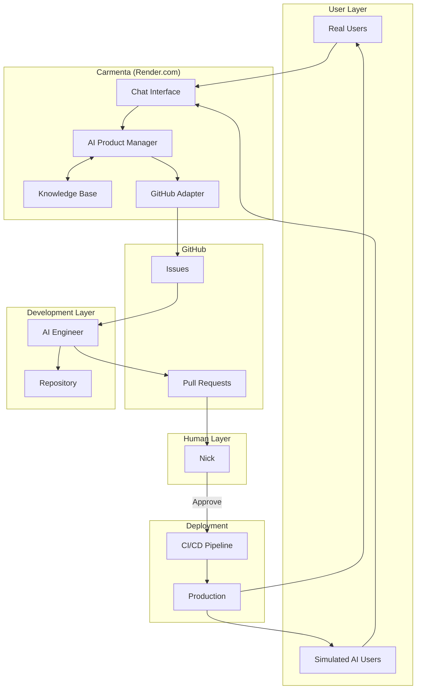
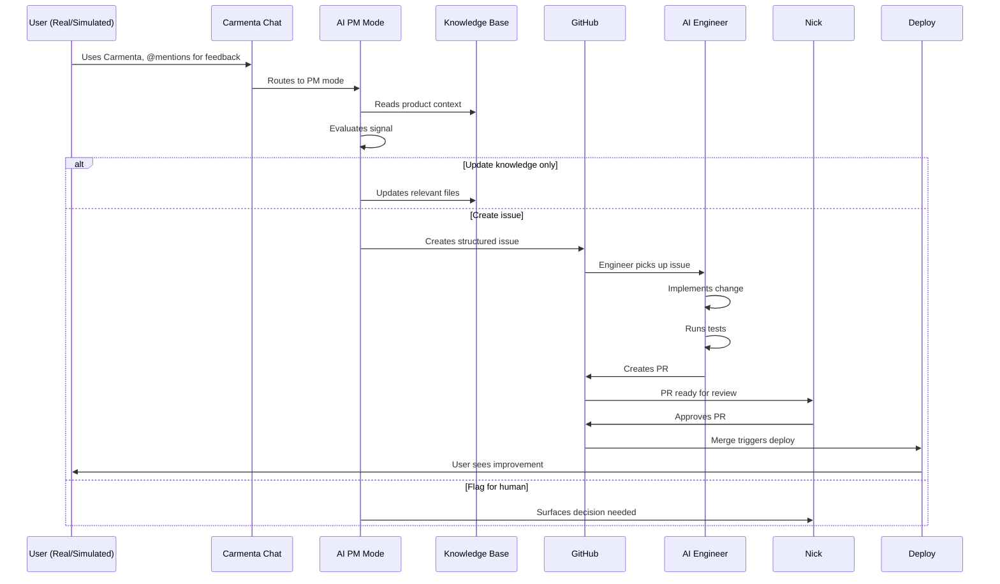
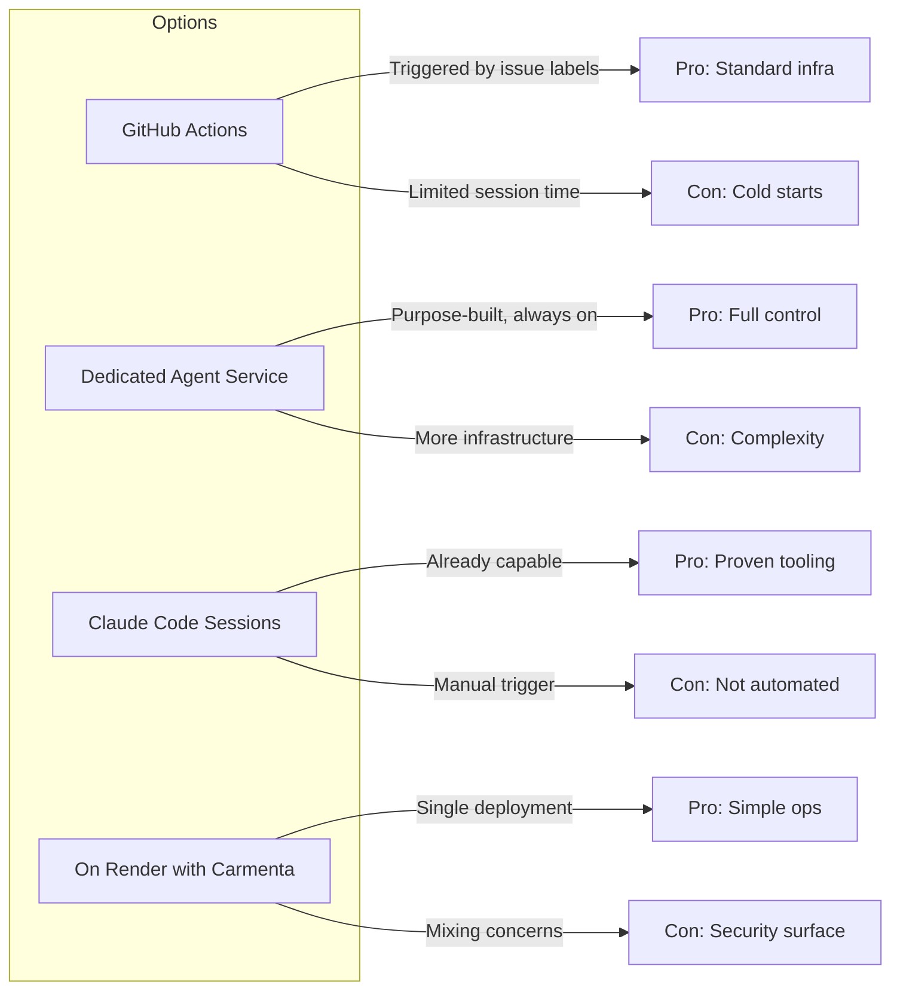
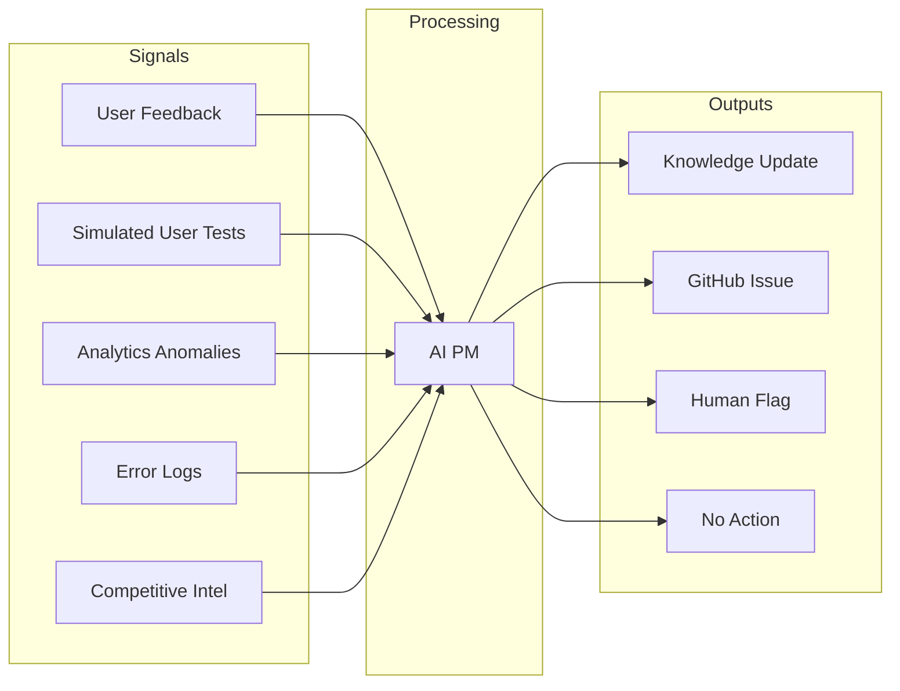
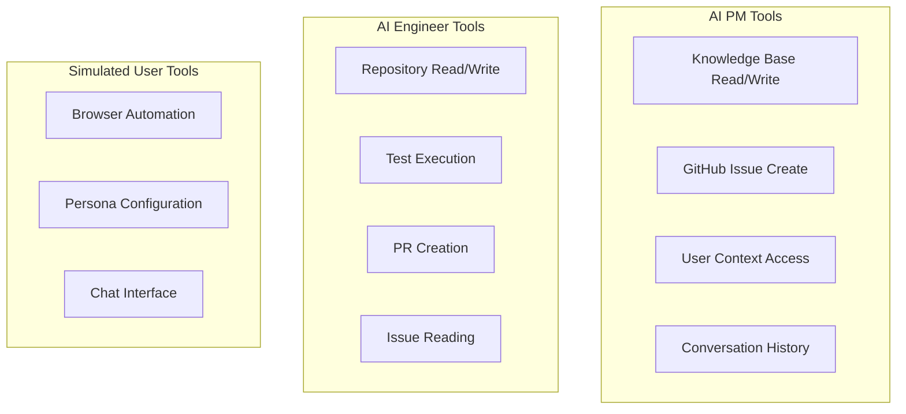

# System Architecture

The autonomous AI PM system consists of five actors coordinating through GitHub as the
central workflow backbone.

## High-Level Flow



## The Complete Feedback Loop



## Where Each Actor Lives

### AI Product Manager — Inside Carmenta

The PM is a mode of Carmenta, not a separate service. When a user @mentions Carmenta or
provides feedback, the system injects PM-mode instructions into the conversation.

**Why inside Carmenta:**

- Natural access to user context (who is this person, what were they trying to do)
- Access to conversation history
- Can read the knowledge base directly
- Maintains Carmenta's personality and "we" framing

**What PM needs access to:**

- Knowledge base (read/write)
- GitHub API (create issues)
- User context from current session
- Conversation history

### AI Engineer — Separate from Carmenta

The Engineer is intentionally separate. It needs different capabilities (repo write
access, test execution, PR creation) that would be inappropriate for the user-facing
system.

**Options for where Engineer lives:**



**Recommended approach:** Start with Claude Code sessions (manual trigger), evolve to
GitHub Actions or dedicated service.

### Simulated Users — External Harness

Simulated users are completely external. They interact with Carmenta through the browser
like real users would.

**Why external:**

- Tests the real user experience, not internal APIs
- Can run against staging or production
- Failure modes match real user failure modes
- Clear separation between testing and product

**Implementation:** Browser automation (Browseros or Playwright) driving AI-powered
personas.

## Data Flow Detail

### Signal Collection



### GitHub Issue Structure

When the PM creates an issue, it follows this structure:

```markdown
## Summary

[One sentence: what needs to happen]

## Context

- **Signal source:** [user feedback / simulated test / analytics / error log]
- **Reporter:** [user type or test persona]
- **User goal:** [what they were trying to accomplish]
- **Current behavior:** [what's happening]
- **Expected behavior:** [what should happen]

## Acceptance Criteria

- [ ] Criterion 1
- [ ] Criterion 2

## Product Context

[Links to relevant knowledge/ files]

## Suggested Priority

[critical / high / medium / low]

## Labels

[bug | enhancement | feature | needs-triage]

---

Created by Carmenta AI PM
```

### PR Structure

When the Engineer creates a PR:

```markdown
## Summary

[What this PR does]

## Linked Issue

Closes #[issue number]

## Changes

- [Change 1]
- [Change 2]

## Test Plan

- [How to verify this works]

## Screenshots

[If UI changes]

---

Implemented by Carmenta AI Engineer
```

## Authentication and Authorization

### GitHub Integration

**Recommended: GitHub App**

A GitHub App installed on the carmentacollective organization:

- Creates issues as "Carmenta" identity
- Creates PRs as "Carmenta" identity
- Scoped permissions (issues, PRs, not admin)
- Clear audit trail

**Required credentials:**

- `GITHUB_APP_ID`
- `GITHUB_APP_PRIVATE_KEY`
- `GITHUB_APP_INSTALLATION_ID`

**Alternative: Personal Access Token**

Simpler but less appropriate for automated actions:

- Tied to individual account
- Less traceable
- Broader permissions than needed

### Simulated User Authentication

Simulated users need to authenticate with Carmenta like real users. Options:

1. **Test accounts** — Dedicated Clerk accounts for each persona
2. **Bypass auth for test environment** — Simulated users only run against staging
3. **Service token** — Special token that identifies simulated users

Recommendation: Start with test accounts on staging, add service token for production
testing later.

## Tooling Architecture

### What Tools Does Each Actor Need?



### Implementation Options for AI Engineer

**Option A: gh CLI with Bash access**

Give the Engineer bash access and let it use `gh` CLI for GitHub operations.

Pros:

- Simple, familiar tooling
- Works with existing patterns
- `gh` handles auth complexity

Cons:

- Requires proper auth setup
- Security surface if on same infra as user-facing app
- Mixing concerns

**Option B: Claude Code as orchestrated tool**

The PM doesn't implement—it creates issues. A separate process (could be human-triggered
Claude Code session) picks up issues and does implementation.

Pros:

- Clean separation of concerns
- Claude Code is already capable
- Human can review issue before triggering implementation

Cons:

- Not fully automated
- Requires manual trigger (initially)

**Option C: Dedicated agent service**

Purpose-built service that watches for issues and implements them.

Pros:

- Full control over behavior
- Can be always-on
- Purpose-built for the task

Cons:

- More infrastructure to build
- Needs its own monitoring/ops

**Recommended progression:**

1. **Phase 1:** PM creates issues, human triggers Claude Code manually
2. **Phase 2:** GitHub Action triggers on issue labels, runs Claude Code
3. **Phase 3:** Dedicated agent service with full autonomy for approved change types

### Tiered Access Model

Different modes of Carmenta have different capabilities:

| Mode          | Access Level | Can Do                                      |
| ------------- | ------------ | ------------------------------------------- |
| User-facing   | Limited      | Chat, use tools, access integrations        |
| PM Mode       | Elevated     | Above + read/write knowledge, create issues |
| Engineer Mode | Full         | Above + repo access, create PRs, run tests  |

This tiering is logical, not necessarily infrastructure. The same underlying system
could operate in different modes with different tool access.

## State Management

### What State Exists Where?

| State                   | Location               | Persistence |
| ----------------------- | ---------------------- | ----------- |
| User conversations      | Supabase               | Permanent   |
| Knowledge base          | Git repo               | Permanent   |
| GitHub issues           | GitHub                 | Permanent   |
| PRs                     | GitHub                 | Permanent   |
| Simulated user sessions | Browseros              | Ephemeral   |
| PM decisions            | Logged in conversation | Permanent   |

### Conflict Resolution

When multiple signals suggest conflicting changes:

1. PM recognizes conflict
2. PM flags for human decision rather than choosing
3. Human resolves direction
4. PM proceeds with resolved direction

When multiple Engineers work on related issues:

1. Each PR is independent
2. Merge conflicts surface at PR review
3. Human resolves conflicts during approval

## Monitoring and Observability

### What to Track

**PM Performance:**

- Signals processed per day
- Issues created per signal type
- Knowledge updates made
- Human flags raised

**Engineer Performance:**

- Issues picked up
- PRs created
- PR approval rate
- Time from issue to merged PR

**Simulated User Coverage:**

- Personas active
- Interactions per day
- Issues discovered
- Coverage of product surface

**Loop Health:**

- End-to-end cycle time (signal → deployed fix)
- Human intervention rate
- False positive rate (issues that shouldn't have been created)

### Alerting

Alert when:

- PM hasn't processed signals in X hours
- PR rejection rate exceeds threshold
- Simulated users can't complete basic flows
- End-to-end cycle time exceeds threshold

## Security Considerations

### Principle of Least Privilege

Each actor gets only the access it needs:

- PM: Knowledge read/write, issue create (not PR, not merge)
- Engineer: Repo access, PR create (not merge)
- Simulated users: Same as real users (no special access)

### Audit Trail

Every action is logged:

- PM decisions (why issue was/wasn't created)
- Engineer implementations (what changed, why)
- Human approvals (who approved, when)

### Boundaries

Hard rules the system cannot violate:

- Never merge to main without human approval
- Never modify auth/security code without human review
- Never access production data in simulated tests
- Never create issues that bypass human review

## Evolution Path

### Near Term (2025)

- PM mode in Carmenta creates issues
- Manual Claude Code sessions for implementation
- Basic simulated user testing on staging

### Medium Term (2026)

- Automated issue pickup via GitHub Actions
- Tiered approval (verified bugs auto-merge after validation)
- Simulated users running continuously
- PM learns when to ask vs proceed

### Long Term (2027+)

- Fully autonomous loop for approved change types
- System proposes its own improvements
- Real-time response to user friction
- Self-healing for verified bugs
