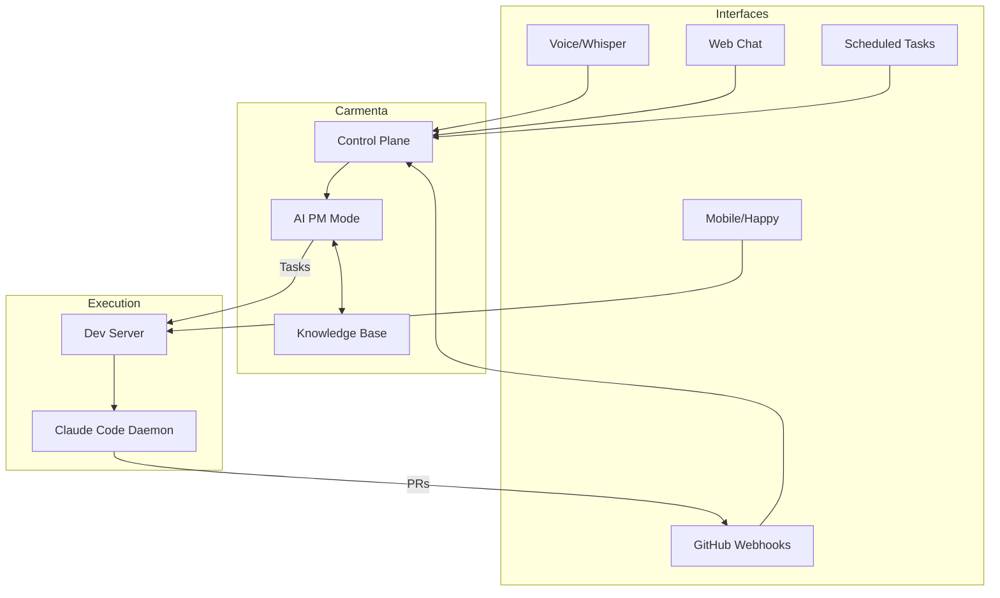

# Execution Infrastructure

The AI PM system processes signals and creates issues. The AI Engineer implements
changes. But where does the Engineer actually run? This document explores that critical
question.

**Related**: This infrastructure also powers [God Mode](../components/god-mode.md)—the
product tier where AI acts as the user across their entire digital surface. The same
execution backends serve both the autonomous development loop and user-facing God Mode
capabilities.

## The Core Problem

Nick's local environment has quality gates that external environments lack:

- Pre-commit hooks (husky) that format, lint, and validate
- ESLint/Prettier configuration tuned for the codebase
- Type checking with strict settings
- Test suites that must pass
- Custom validation scripts

When AI agents run elsewhere (GitHub Actions, Claude.ai/code, ChatGPT Codex), they
bypass these gates. Code gets written without quality checks, PRs fail CI, and manual
cleanup is required.

The goal: **AI operates with the same quality guarantees as local development.**

## Why This Matters for the 2027 Vision

The autonomous loop described in README.md depends on reliable code generation:

```
Signals → AI PM → Issues → AI Engineer → PRs → Human Approval → Deploy
```

If the Engineer produces low-quality PRs, the loop breaks. Human approval becomes
human-cleanup, destroying the leverage.

The infrastructure decision directly impacts:

- **Velocity**: Clean PRs merge fast, messy PRs require iteration
- **Trust**: Consistent quality builds confidence for expanded autonomy
- **Scaling**: The loop can only scale if quality is automatic

## Proposed Approaches

### Nick's Initial Ideas

#### 1. Dedicated Development Server

A server running Claude Code with full repo access and Nick's environment.

**What it solves:**

- Full environment fidelity
- Always-on availability
- Cross-repo orchestration
- Can create new repos

**Challenges:**

- Infrastructure cost and maintenance
- Keeping environment in sync with local changes
- Network security for a machine with repo write access
- Single point of failure

**Verdict:** High feasibility. This is the most direct solution.

#### 2. Happy.engineering Mobile Interface

Mobile app that remote-controls local Claude Code sessions.

**What it solves:**

- Voice/mobile access to full local environment
- Uses existing Claude Code capabilities
- No new infrastructure to maintain

**Challenges:**

- Requires Nick's machine to be running
- Doesn't enable "while sleeping" automation
- Depends on network connectivity to local machine

**Verdict:** Good complement, not a complete solution. Solves the "talk to it from
anywhere" problem but not autonomous operation.

#### 3. GitHub App (Carmenta Identity)

All automated actions performed as "Carmenta Bot" via GitHub App.

**What it solves:**

- Clean audit trail
- Proper identity for automated commits
- Scoped permissions
- Already partially exists

**Challenges:**

- Doesn't solve environment fidelity by itself
- The App is identity, not execution environment

**Verdict:** Essential for identity. Orthogonal to execution environment.

#### 4. Carmenta Web Interface with "God Mode"

Special admin access in Carmenta that enables cross-repo operations.

**What it solves:**

- Unified interface for all operations
- Natural extension of existing product
- Could combine voice + text + commands

**Challenges:**

- Still need to solve where execution happens
- Mixing product and personal infrastructure

**Verdict:** Good interface layer. Needs execution backend.

### Alternative Approaches

#### 5. Infrastructure-as-Code Parity

Make the environment 100% reproducible so WHERE code runs doesn't matter.

**Concept:** Instead of bringing code to Nick's environment, bring Nick's environment
everywhere. Codify everything:

- devcontainer.json for full environment specification
- .tool-versions for language runtimes
- Pre-commit config that CI also runs
- Docker-based development environment

**What it solves:**

- Any execution environment can have identical quality gates
- GitHub Actions, Codespaces, and local all equivalent
- No special infrastructure to maintain
- Works with any AI coding tool

**Challenges:**

- Requires significant upfront investment in containerization
- Some tools resist containerization (macOS-specific, GUI dependencies)
- Overhead of maintaining container definitions
- May not capture all local customizations

**Verdict:** Philosophically elegant. High implementation effort. Best combined with
other approaches.

#### 6. Ephemeral Development Pods

Orchestration layer that spawns fresh development environments on demand.

**Concept:** A control plane receives tasks and spawns container-based development
environments. Each pod:

- Clones from infrastructure-as-code definition
- Has full environment with all quality gates
- Claude Code runs inside, completes task, creates PR
- Pod destroyed after task completion

Could use: Fly.io Machines, Railway containers, Gitpod, GitHub Codespaces.

**What it solves:**

- No persistent infrastructure to maintain
- Each task gets clean environment
- Scales horizontally
- Environment guaranteed fresh and correct

**Challenges:**

- Cold start latency (spinning up new environment)
- Cost scales with usage
- Complexity of orchestration layer
- Need infrastructure-as-code first

**Verdict:** Powerful pattern for scale. Depends on infrastructure-as-code investment.

#### 7. Local-First with Event Queue

Claude Code stays local; events queue until machine available.

**Concept:** Accept that local execution is the gold standard. Build an event bridge:

- Webhooks, voice commands, scheduled tasks → Event queue
- Events processed when local machine available
- Async model: intake is always-on, execution is best-effort

Could use: Inngest, Temporal, or simple Redis queue.

**What it solves:**

- No compromise on environment fidelity
- Uses existing local setup
- Simple architecture
- Low infrastructure cost

**Challenges:**

- Latency when machine unavailable
- Doesn't enable "while sleeping" fully
- Requires local machine to be on most of the time
- Not truly always-on

**Verdict:** Pragmatic for personal use. Not suitable for production autonomy.

## Recommended Architecture

### Primary: The Clone Machine

A dedicated development server that mirrors Nick's environment exactly.

**Implementation:**

1. **Hardware**: Mac Mini (for macOS parity) or cloud VM (for reliability)
2. **Configuration**: All dotfiles, tool versions, global packages synced from source
3. **Repos**: All active repos cloned with proper remotes
4. **Daemon**: Claude Code running as persistent service
5. **Intake**: Webhook receiver for GitHub events, Inngest for scheduled tasks

**Why Mac Mini:**

- Same OS as Nick's daily driver
- Native performance, no emulation overhead
- One-time cost, no ongoing cloud bills
- Can sit at home on good internet

**Why Cloud VM:**

- No local hardware to maintain
- Better uptime guarantees
- Accessible from anywhere without port forwarding
- Can be Linux-based with proper environment parity

### Orchestration: Carmenta as Control Plane

Carmenta becomes the unified interface for all automation:



**Control Plane responsibilities:**

- Route signals to appropriate handler
- Maintain task queue and status
- Provide visibility into automation state
- Handle "God mode" admin operations

**The God Mode interface:**

- Live in Carmenta, accessible only to Nick
- Direct commands: "Create a new repo called X", "Merge all passing dependabot PRs"
- Task visibility: What's queued, what's running, what needs attention
- Emergency controls: Pause automation, clear queue, manual override

### Identity: GitHub App

All automated actions use the "Carmenta" GitHub App identity:

- PRs created by @carmenta-bot
- Issues created by @carmenta-bot
- Clear audit trail separate from Nick's activity
- Scoped permissions per repo

### Quality: Belt and Suspenders

**Belt: Infrastructure-as-Code**

- Containerize development environment over time
- Pre-commit hooks that work identically local and CI
- Quality checks codified, not implicit

**Suspenders: Dev Server Parity**

- Dev server mirrors local environment exactly
- Changes to local config automatically propagate
- Regular parity checks: run same tests both places

## The 2027 Vision

By 2027, the infrastructure should support:

### Full Autonomy for Trusted Paths

- Dependabot PRs: Auto-merge if tests pass
- Verified bug fixes: Auto-merge after validation
- Spec-defined features: Auto-implement, auto-test, human review

### Human Focus on Novel Decisions

- Strategic changes always surface for review
- Vision/boundary changes require explicit approval
- Novel situations without precedent flagged

### Voice-First Operation

- Nick speaks to Carmenta throughout the day
- Background tasks queue and execute
- Morning briefing: "Here's what shipped while you slept"

### Self-Improving Infrastructure

- The system tracks its own success rate
- Proposes autonomy expansions based on demonstrated reliability
- Continuous boundary negotiation between human and AI

## Implementation Sequence

### Phase 1: Dedicated Dev Server (Now)

1. Provision Mac Mini or cloud VM
2. Replicate Nick's environment: dotfiles, tools, repos
3. Install Claude Code, configure as daemon
4. Simple webhook receiver for GitHub events
5. Test: Can it pick up an issue and create a PR?

### Phase 2: Carmenta Integration (Q1 2025)

1. Build Control Plane in Carmenta
2. Route tasks from web/voice to dev server
3. "God Mode" admin interface
4. Task visibility and status tracking

### Phase 3: Autonomous Paths (Q2 2025)

1. Auto-merge for dependabot (tests passing)
2. Label-based auto-implementation triggers
3. Simulated user integration
4. Metrics and alerting for loop health

### Phase 4: Full Vision (2025-2026)

1. Infrastructure-as-code for environment parity
2. Ephemeral pods for parallel execution
3. Self-improving autonomy boundaries
4. Voice-first as primary interface

## Open Questions

### Where Should the Dev Server Live?

| Option          | Pros                             | Cons                           |
| --------------- | -------------------------------- | ------------------------------ |
| Mac Mini @ home | macOS parity, one-time cost      | Uptime depends on home network |
| Cloud VM        | Reliable, accessible             | Linux not macOS, ongoing cost  |
| Both            | Redundancy, best of both         | Complexity, sync overhead      |
| Codespaces      | Zero infra, scales automatically | Environment parity challenges  |

**Recommendation:** Start with cloud VM for reliability. Add Mac Mini if macOS parity
becomes critical.

### How Does the Dev Server Get Tasks?

| Option           | Pros                  | Cons                   |
| ---------------- | --------------------- | ---------------------- |
| GitHub Webhooks  | Direct, low latency   | Requires public URL    |
| Inngest          | Queuing, retry, cron  | Another dependency     |
| Polling          | Simple, no public URL | Latency, wasted cycles |
| Carmenta routing | Unified control plane | Coupling to product    |

**Recommendation:** Inngest for task orchestration. Clean queuing model, built for this
use case.

### Should This Be Part of Carmenta or Separate?

**Arguments for integration:**

- Unified interface for users
- Knowledge base is already there
- Natural extension of AI PM

**Arguments for separation:**

- Personal infrastructure shouldn't couple to product
- Different security posture
- May want to use for non-Carmenta repos

**Recommendation:** Separate infrastructure, Carmenta as one interface. The dev server
should be usable independently, with Carmenta as a convenient control plane.

### What About Multi-Repo Orchestration?

Some tasks require coordinated changes across repos:

- Update shared types in one repo, consumers in others
- Create new repo with scaffolding from templates
- Sync configuration across all projects

**Approach:** The dev server has all repos. Cross-repo coordination is just file
operations across directories. GitHub App can push to any repo in the org.

## Relationship to Existing Documentation

This document extends:

- [README.md](./README.md) — The "where does Engineer live?" question
- [architecture.md](./architecture.md) — Detailed data flows
- [actors.md](./actors.md) — AI Engineer specification
- [open-questions.md](./open-questions.md) — Several questions answered here

## God Mode: From Personal Infrastructure to Product

The execution infrastructure described here isn't just for Nick's personal automation—it
becomes the [God Mode](../components/god-mode.md) product tier for Carmenta users.

### The Key Insight

The same infrastructure that enables autonomous development also enables AI acting as
the user:

| Capability    | AI PM Use Case               | God Mode Use Case         |
| ------------- | ---------------------------- | ------------------------- |
| Dev Server    | Code with quality gates      | User's local environment  |
| Mac access    | —                            | iMessage, Apple-specific  |
| Claude Code   | Implement issues, create PRs | Code automation for users |
| Messaging     | —                            | WhatsApp, Signal, SMS     |
| Orchestration | Scheduled code tasks         | Scheduled user tasks      |

### Two Execution Tiers

The orchestration layer routes tasks to appropriate backends:

```
┌─────────────────────────────────────────────────────────────────────┐
│                    CARMENTA ORCHESTRATION                            │
│    Scheduling │ Task Queue │ Routing │ Status │ Audit Trail         │
└───────────────────────────────┬─────────────────────────────────────┘
                                │
                ┌───────────────┴───────────────┐
                │                               │
                ▼                               ▼
        ┌───────────────┐               ┌───────────────┐
        │  EPHEMERAL    │               │  GOD MODE     │
        │  COMPUTE      │               │  (Managed)    │
        │               │               │               │
        │  • Fly.io/E2B │               │  • Cloud VM   │
        │  • Integrations│              │  • Mac Mini   │
        │  • Standard AI │               │  • iMessage   │
        │    Team tasks │               │  • Full access│
        │               │               │               │
        │  Tier: Base   │               │  Tier: Friends│
        └───────────────┘               └───────────────┘
```

### Messaging Platform Constraints

iMessage requires macOS with signed-in Apple ID—no workaround. This is why God Mode
requires Mac infrastructure.

God Mode is invite-only for trusted friends. Nick operates all infrastructure—no BYOM
complexity.

See [God Mode](../components/god-mode.md) for full messaging platform analysis.

## Summary

The execution infrastructure that enables the 2027 vision:

1. **Dedicated Dev Server** — Full environment fidelity, always-on
2. **Carmenta Control Plane** — Unified interface, task routing, visibility
3. **GitHub App Identity** — Clean audit trail, proper permissions
4. **Infrastructure-as-Code** — Environment parity across all execution contexts
5. **God Mode Product Tier** — Same infrastructure, packaged for users

Start with the dev server. It's the highest-leverage, most direct solution. Everything
else builds on having reliable execution with quality guarantees.

The infrastructure you build for yourself becomes the infrastructure you sell to others.
