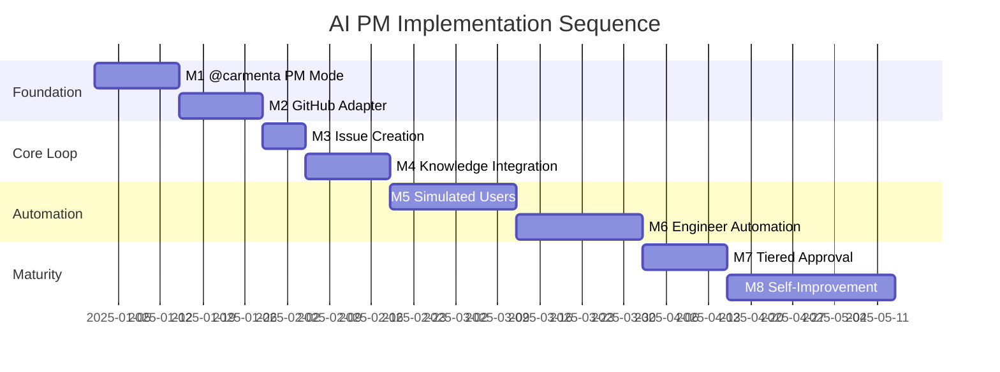
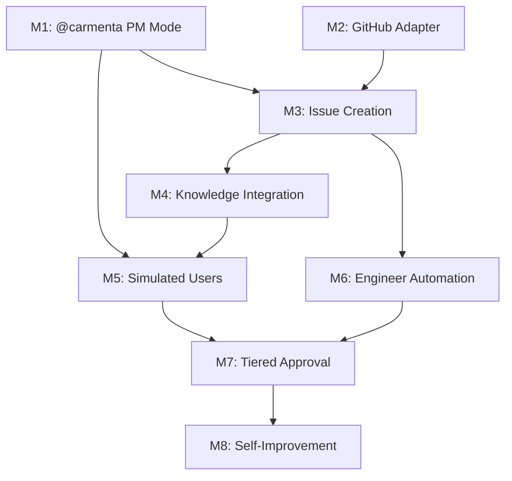

# Implementation Milestones

Phased approach to building the autonomous AI PM system. Each milestone delivers
standalone value while enabling the next phase.

## Milestone Overview



## M1: @carmenta PM Mode

**Goal:** User can @mention Carmenta to provide feedback, and she responds as a product
manager gathering context.

### What Gets Built

1. **@mention detection** in chat input
2. **PM mode system prompt** injection when @carmenta detected
3. **Conversation flow** for gathering feedback context
4. **UI indicator** showing PM mode is active

### Technical Approach

When `@carmenta` appears in user message:

1. Route to PM mode prompt (different from standard Carmenta)
2. PM prompt includes product context from knowledge base
3. Carmenta asks clarifying questions
4. Conversation stored with PM mode flag

### Success Criteria

- User can type `@carmenta I had trouble with X`
- Carmenta responds in PM mode, asking clarifying questions
- Conversation captures structured feedback
- Feedback stored in database with type flag

### Dependencies

- Existing chat infrastructure
- Knowledge base readable by system prompt

### Deliverables

- [ ] @mention parser in message input
- [ ] PM mode system prompt
- [ ] PM mode UI indicator
- [ ] Feedback conversation storage schema
- [ ] Test: complete feedback conversation flow

---

## M2: GitHub Adapter

**Goal:** Carmenta can create GitHub issues via API.

### What Gets Built

1. **GitHub adapter** following existing adapter pattern
2. **GitHub App authentication** setup
3. **Issue creation operation** with structured format
4. **Error handling** for API failures

### Technical Approach

Create `lib/integrations/adapters/github.ts`:

- Extends ServiceAdapter base class
- Implements `create_issue` operation
- Uses GitHub App auth (JWT → installation token)
- Returns issue URL on success

### Success Criteria

- Adapter can create issue on carmentacollective/carmenta repo
- Issue has structured format (summary, context, acceptance criteria)
- Labels applied correctly
- Error handling for auth failures, rate limits

### Dependencies

- GitHub App created and installed on repo
- App credentials in environment variables

### Deliverables

- [ ] GitHub App created in GitHub settings
- [ ] App installed on carmentacollective/carmenta
- [ ] Environment variables configured
- [ ] GitHubAdapter class implementation
- [ ] create_issue operation
- [ ] Unit tests for adapter
- [ ] Integration test creating real issue

---

## M3: Issue Creation from PM

**Goal:** AI PM can convert feedback conversations into GitHub issues.

### What Gets Built

1. **Issue creation decision logic** in PM mode
2. **Structured issue generation** from conversation
3. **Confirmation flow** before creating issue
4. **Issue tracking** (link issue back to conversation)

### Technical Approach

At end of PM feedback conversation:

1. PM synthesizes conversation into issue structure
2. Shows draft issue to user for confirmation
3. On confirm, calls GitHub adapter
4. Stores issue link in conversation metadata

### Success Criteria

- PM can extract issue details from conversation
- User confirms before issue creation
- Issue created with correct structure
- Conversation linked to issue

### Dependencies

- M1: @carmenta PM mode working
- M2: GitHub adapter working

### Deliverables

- [ ] Issue synthesis logic
- [ ] Confirmation UI component
- [ ] Issue creation trigger from PM mode
- [ ] Conversation-to-issue linking
- [ ] Test: end-to-end feedback → issue flow

---

## M4: Knowledge Integration

**Goal:** AI PM reads knowledge base for context when processing feedback.

### What Gets Built

1. **Knowledge retrieval** for PM mode
2. **Relevant context selection** (vision, boundaries, components)
3. **Decision support** (is this in scope? does it conflict?)
4. **Knowledge update suggestions** (if feedback reveals new learning)

### Technical Approach

When PM mode activates:

1. Load relevant knowledge files into context
2. PM evaluates feedback against product boundaries
3. PM cites knowledge files in reasoning
4. PM can suggest knowledge updates (separate from issues)

### Success Criteria

- PM responses reference specific knowledge files
- Out-of-scope feedback correctly identified
- PM suggests knowledge updates when appropriate
- No hallucination of product direction

### Dependencies

- M1: @carmenta PM mode
- Existing knowledge folder structure

### Deliverables

- [ ] Knowledge context builder for PM mode
- [ ] Scope checking against boundaries.md
- [ ] Knowledge update suggestion flow
- [ ] Test: out-of-scope feedback handled correctly
- [ ] Test: knowledge update suggested for new learning

---

## M5: Simulated Users

**Goal:** AI-powered test users continuously exercise Carmenta.

### What Gets Built

1. **Persona definitions** in configuration
2. **Browser automation harness** (Browseros or Playwright)
3. **Goal-directed behavior generation**
4. **Signal reporting** to PM mode
5. **Session management** (auth, state, cleanup)

### Technical Approach

External service that:

1. Loads persona from configuration
2. Launches browser session
3. Authenticates with test account
4. Generates goal-directed behavior via LLM
5. Reports friction/success signals to Carmenta via @carmenta mention
6. Ends session, logs results

### Success Criteria

- Simulated user can complete basic flows
- Friction detected and reported to PM
- Signals appear in PM's view like real feedback
- Multiple personas with different behaviors

### Dependencies

- M1: @carmenta PM mode
- Browseros or Playwright setup
- Test accounts in Clerk

### Deliverables

- [ ] Persona configuration schema
- [ ] Three initial personas defined
- [ ] Browser automation harness
- [ ] LLM-driven behavior generation
- [ ] Signal reporting integration
- [ ] Session management (auth, cleanup)
- [ ] Test: simulated user completes flow
- [ ] Test: friction detected and reported

---

## M6: Engineer Automation

**Goal:** AI Engineer picks up issues and creates PRs automatically.

### What Gets Built

1. **Issue pickup mechanism** (webhook or polling)
2. **Implementation orchestration** (Claude Code or custom)
3. **Test execution** and validation
4. **PR creation** with structured format
5. **Issue linking** in PR

### Technical Approach

Option A: GitHub Action triggered by issue labels

```yaml
on:
  issues:
    types: [labeled]
jobs:
  implement:
    if: contains(github.event.label.name, 'ready-for-eng')
    steps:
      - uses: actions/checkout@v4
      - run: # Trigger Claude Code or custom agent
```

Option B: Polling service that checks for new issues

### Success Criteria

- Labeled issues trigger implementation
- Agent creates working implementation
- Tests pass before PR creation
- PR links to original issue
- PR has structured format

### Dependencies

- M3: Issue creation working
- Claude Code or agent SDK setup

### Deliverables

- [ ] Issue pickup mechanism chosen and implemented
- [ ] Implementation orchestration
- [ ] Test execution in CI
- [ ] PR creation with format
- [ ] Issue-PR linking
- [ ] Test: issue → PR end-to-end

---

## M7: Tiered Approval

**Goal:** Different change types have different approval requirements.

### What Gets Built

1. **Change classification** (bug fix, feature, breaking)
2. **Approval rules** per classification
3. **Validation pipeline** for auto-merge candidates
4. **Notification system** for different paths

### Technical Approach

| Change Type      | Classification                      | Approval Path              |
| ---------------- | ----------------------------------- | -------------------------- |
| Verified bug fix | Bug fix validated by simulated user | Auto-merge after CI        |
| New feature      | Feature matching issue scope        | Human review               |
| Breaking change  | Affects existing behavior           | Human review + deploy gate |

### Success Criteria

- Changes correctly classified
- Auto-merge works for verified bug fixes
- Human review required for features
- Breaking changes flagged clearly

### Dependencies

- M5: Simulated users can validate fixes
- M6: Engineer automation working

### Deliverables

- [ ] Change classification logic
- [ ] Approval rules configuration
- [ ] Auto-merge workflow for verified fixes
- [ ] Human notification for review-required
- [ ] Test: bug fix auto-merged after validation
- [ ] Test: feature requires human review

---

## M8: Self-Improvement Loop

**Goal:** System can propose and implement improvements to itself.

### What Gets Built

1. **Pattern detection** across feedback and signals
2. **Improvement proposal generation**
3. **Self-referential issues** (improvements to PM, Engineer, etc.)
4. **Meta-learning** (what improvements worked?)

### Technical Approach

PM analyzes patterns:

- Recurring friction points
- Common failure modes
- Successful improvement patterns

Generates meta-issues:

- "Improve PM's handling of X type feedback"
- "Add new simulated user persona for Y use case"
- "Adjust approval rules based on Z pattern"

### Success Criteria

- System identifies improvement opportunities
- Meta-issues created with clear rationale
- Implemented improvements measurably help
- Feedback loop on improvement effectiveness

### Dependencies

- All previous milestones
- Sufficient data from loop operation

### Deliverables

- [ ] Pattern detection across signals
- [ ] Improvement proposal generation
- [ ] Meta-issue creation flow
- [ ] Improvement effectiveness tracking
- [ ] Test: system proposes valid improvement
- [ ] Test: implemented improvement shows positive effect

---

## Milestone Dependencies



## Quick Wins

If you want to validate the concept before full implementation:

### Spike 1: Manual PM Mode

Manually inject PM context into a conversation. See if Carmenta can gather feedback
effectively with just prompt engineering.

### Spike 2: Manual Issue Creation

Have Carmenta draft an issue in chat. Copy/paste to GitHub. Validate the structure
works.

### Spike 3: Manual Simulated User

You play a persona. Go through flows. Report friction. See if PM handles it correctly.

## What to Build First

**Recommended starting point: M1 + M2 in parallel**

M1 (@carmenta PM mode) is pure prompt engineering and UI—can ship quickly.

M2 (GitHub adapter) is infrastructure that enables everything else.

Both can proceed simultaneously. M3 (issue creation) follows immediately after both
complete.

## Ongoing After All Milestones

- Monitor loop health metrics
- Expand simulated user personas
- Refine approval boundaries
- Improve PM judgment through feedback
- Optimize Engineer implementation quality
