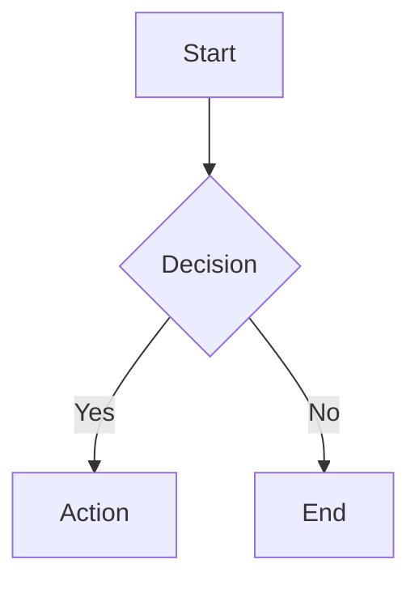
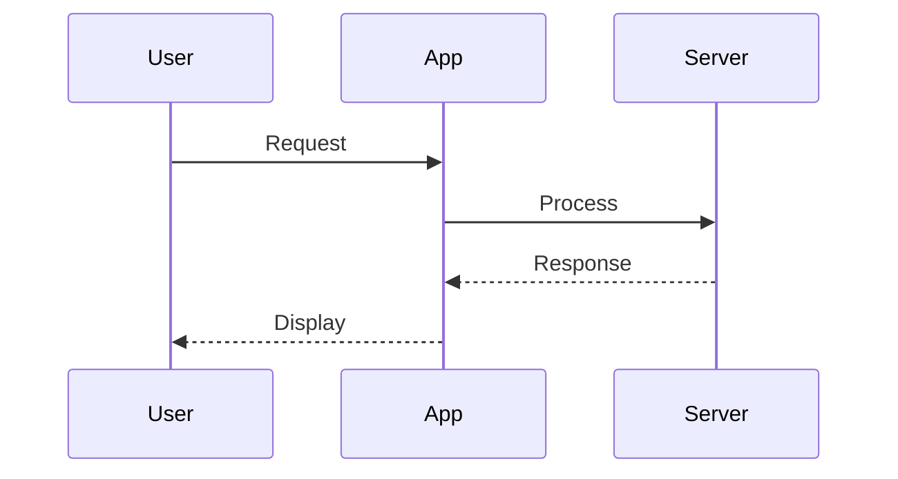
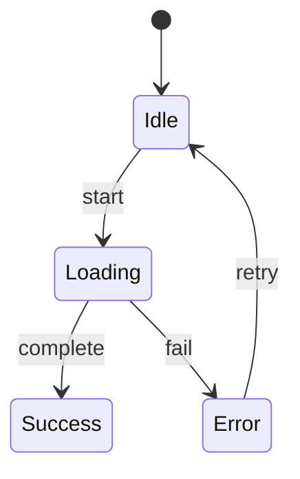
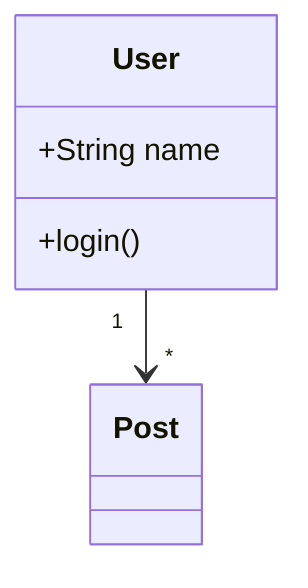
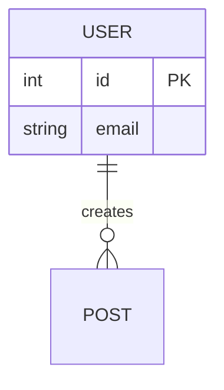

# Inline Diagrams

## What This Is

Carmenta renders inline diagrams from AI responses using Streamdown, Vercel's
streaming-optimized markdown renderer. When an LLM includes a Mermaid code block in its
response, Streamdown renders it as an interactive SVG diagram with built-in controls for
fullscreen viewing, downloading, and copying.

## Why This Matters

Diagrams communicate system architecture, data flows, state machines, and relationships
more effectively than prose. LLMs naturally produce Mermaid diagrams when visualizations
help understanding. The renderer must handle diagrams gracefully during streaming (no
flickering on incomplete syntax) and provide interactive controls for exploring complex
diagrams.

## Current Implementation

### Core Component

**Location**: `components/ui/markdown-renderer.tsx`

The `MarkdownRenderer` component wraps Streamdown with Carmenta's styling:

```typescript
<Streamdown mode="streaming" isAnimating={isStreaming} controls={true}>
  {content}
</Streamdown>
```

Configuration:

- `mode="streaming"` - Optimized for token-by-token updates from LLM responses
- `isAnimating={isStreaming}` - Disables interactive buttons during active streaming to
  prevent copying incomplete diagrams
- `controls={true}` - Enables all interactive controls (fullscreen, download, copy)

### Tailwind Configuration

**Location**: `tailwind.config.ts`

Streamdown's distribution files are included in Tailwind's content paths:

```typescript
content: ["./node_modules/streamdown/dist/**/*.js"];
```

This ensures Streamdown's utility classes are available for diagram rendering.

### Styling

**Location**: `app/globals.css`

Diagram styling inherits from the `.holo-markdown` container class. Streamdown handles
diagram-specific styling internally with its own CSS.

## Supported Diagram Types

Streamdown supports all standard Mermaid diagram types:

**Flowcharts** - Process visualization with multiple node shapes (rectangles, circles,
diamonds, subroutines). Use for decision trees, processes, and workflows.



**Sequence Diagrams** - Visualize interactions between participants. Use for API flows,
authentication sequences, and system communications.



**State Diagrams** - Model state machines and lifecycle transitions. Use for UI states,
order workflows, and system modes.



**Class Diagrams** - Document object-oriented architecture. Use for data models, type
hierarchies, and system structure.



**Entity Relationship Diagrams** - Model database schemas. Use for data modeling and
schema documentation.



**Pie Charts** - Show proportional data distribution.

**Gantt Charts** - Visualize project timelines and dependencies.

**Git Graphs** - Document version control workflows and branching strategies.

## Rendering Behavior

### During Streaming

Streamdown uses intelligent termination handling for incomplete Mermaid blocks:

1. Partial code fence (` ``` `) - Waits for language identifier
2. Incomplete diagram (`graph TD\n  A[Start]`) - Attempts progressive rendering
3. Complete diagram - Renders full interactive SVG

The `isAnimating` prop disables interactive buttons during streaming to prevent users
from copying or downloading incomplete diagrams.

### Final Rendered State

Once streaming completes:

- Diagram renders as interactive SVG
- Control buttons appear (fullscreen, download, copy)
- Diagram respects current theme (light/dark)

### Error Handling

Streamdown provides a `MermaidErrorComponentProps` interface for custom error handling:

- `error` - The parsing error message
- `chart` - Original Mermaid source code
- `retry` - Function to attempt re-rendering

Carmenta uses Streamdown's default error handling which displays parsing errors inline.
Invalid syntax shows as a code block with error indication rather than crashing the UI.

## User Interaction

### Available Controls

Streamdown provides three controls for Mermaid diagrams:

**Fullscreen** - Opens diagram in overlay mode with dark background. Useful for complex
diagrams that benefit from more screen space.

**Download** - Exports diagram as SVG file. Users can use these in documentation,
presentations, or external tools.

**Copy** - Copies diagram to clipboard. Useful for sharing or embedding elsewhere.

### Current Limitations

**Zoom/Pan**: Streamdown supports zoom/pan via `panZoom: true` in controls
configuration, but Carmenta's current implementation uses `controls={true}` which
enables the default control set. Pan/zoom is not currently enabled.

**PNG Export**: Only SVG export is available. Users needing PNG can export SVG and
convert externally.

**Source View**: No toggle to show/hide the Mermaid source code alongside the rendered
diagram.

## Security Considerations

Streamdown includes security hardening via `rehype-harden`:

**Protocol Restriction** - Dangerous protocols like `javascript:` and `data:` are
blocked. Only safe protocols (http, https, mailto) are permitted.

**Content Sanitization** - HTML content is sanitized before rendering to prevent XSS
attacks.

**Domain Restrictions** - Links and images can be restricted to approved domains
(configurable).

### DoS Prevention

Mermaid diagrams can be computationally expensive to render. Streamdown does not provide
explicit DoS prevention for diagram complexity. Extremely large or deeply nested
diagrams could impact performance. This is a known limitation.

For comparison, LibreChat added explicit security settings for diagram DoS prevention in
their December 2025 Mermaid implementation.

## System Prompt Integration

**Location**: `lib/prompts/system.ts`

The system prompt explicitly encourages diagram usage:

> Use GitHub-flavored markdown when it helps clarity. The interface uses Streamdown,
> which renders Mermaid diagrams and LaTeX math. Use diagrams when visual representation
> aids understanding.

This prompts the LLM to generate Mermaid diagrams when appropriate rather than lengthy
prose descriptions.

## Known Limitations

1. **No pan/zoom controls** - Large diagrams cannot be navigated without fullscreen
2. **SVG-only export** - No PNG or other raster format support
3. **No source toggle** - Cannot view Mermaid source alongside rendered diagram
4. **No DoS limits** - Complex diagrams may impact performance
5. **Theme configuration** - Using Mermaid's defaults, not Carmenta-branded themes

## Future Enhancements

These are potential improvements, not committed roadmap items:

- **Enable pan/zoom** - Add `panZoom: true` to controls configuration for navigating
  large diagrams
- **Custom Mermaid theme** - Configure colors and fonts to match Carmenta's design
  system
- **Diagram complexity limits** - Add client-side guards against overly complex diagrams
- **PNG export** - Add client-side SVG-to-PNG conversion
- **Source view toggle** - Allow users to see and copy the Mermaid source

## Usage Examples

Users create diagrams naturally in conversation:

> "Can you show me the authentication flow?"

The LLM responds with a sequence diagram showing the OAuth flow.

> "Draw the data model for a blog"

The LLM produces an ER diagram showing entities and relationships.

> "Visualize the state machine for an order"

The LLM generates a state diagram showing order lifecycle.

The system prompt encourages this behavior, so users don't need to explicitly request
"Mermaid" format.

## Dependencies

- `streamdown@1.6.10` - Vercel's streaming markdown renderer with built-in Mermaid
  support

---

**Status**: Implemented **Last Updated**: 2024-12-27
